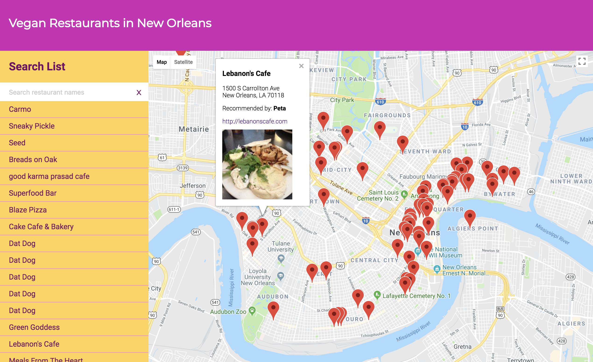

# Neighbourhood Map Project

## Description
This webpage displays a list of vegan restaurants in New Orleans. The restaurants are plotted on a google map and can be filtered using a search input at the top of the page. If you click on the listed items, or on the map marker, an infowindow pops open displaying more information about the restaurant. This site uses Knockout.js, Google Maps, Foursquare APIs, and is responsive.

This project was created for the [Udacity Full Stack Nanodegree Program](https://www.udacity.com/course/full-stack-web-developer-nanodegree--nd004).

## Instructions
1. Download this repository to your computer
2. Double click on the 'index.html' file to open in a browser.

## Tools and technologies
- Knockout.js
- AJAX
- Google Maps Javascript API
- Foursquare API
- jQuery

